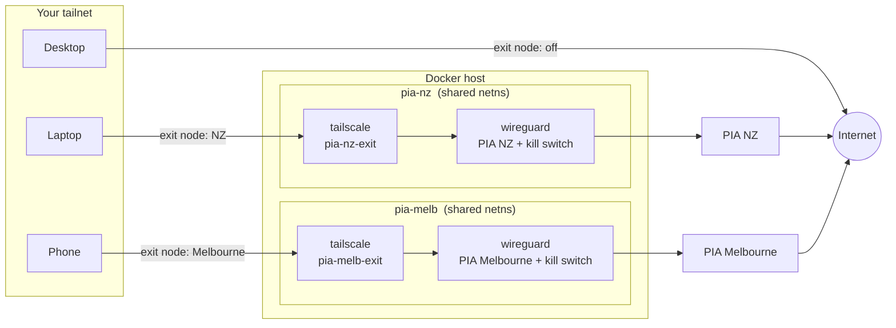
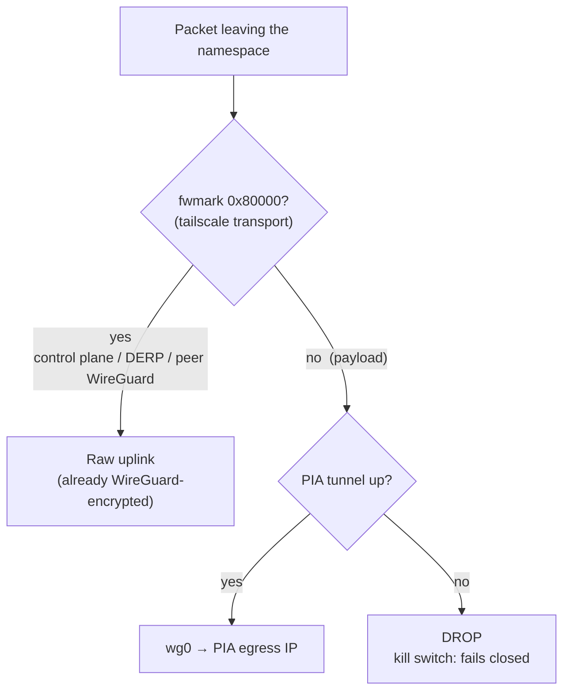

# tailscale-pia-exit

[](LICENSE)
[](https://github.com/latticelabs-au/tailscale-pia-exit/pkgs/container/tailscale-pia-exit)
[](https://tailscale.com/kb/1103/exit-nodes)
[](https://www.privateinternetaccess.com/)

A Tailscale [exit node](https://tailscale.com/kb/1103/exit-nodes) whose internet
egress is routed through a [Private Internet Access](https://www.privateinternetaccess.com/)
WireGuard tunnel.

Pick the node from the exit-node menu on any device in your tailnet and all of
that device's traffic leaves via PIA in the region you chose. You get Tailscale
**and** a commercial VPN at the same time, per device, switchable in two clicks,
without installing a VPN client anywhere.



## Contents

- [Requirements](#requirements)
- [Quick start (single container)](#quick-start-single-container)
- [Quick start (compose, two containers)](#quick-start-compose-two-containers)
- [Multiple regions](#multiple-regions)
- [Configuration reference](#configuration-reference)
- [Why](#why)
- [How traffic is routed](#how-traffic-is-routed)
- [Performance](#performance)
- [Operating notes](#operating-notes)
- [Credits](#credits) · [License](#license)

## Requirements

- Docker with the Compose plugin, `/dev/net/tun` on the host (standard Linux).
- A PIA subscription (`p1234567`-style username + password).
- A Tailscale account.

## Quick start (single container)

The simplest path: one prebuilt image, one `docker run`.

**1. Copy this command and replace the four placeholders:**

```bash
docker run -d --name pia-exit \
  --cap-add NET_ADMIN \
  --device /dev/net/tun \
  --sysctl net.ipv4.ip_forward=1 \
  -e LOC=nz -e USER=p1234567 -e PASS=your_pia_password \
  -e LOCAL_NETWORK=192.168.1.0/24 \
  -e VPNDNS=8.8.8.8,8.8.4.4 \
  -e TS_HOSTNAME=pia-nz-exit \
  -v pia:/pia -v tailscale:/var/lib/tailscale \
  --restart unless-stopped \
  ghcr.io/latticelabs-au/tailscale-pia-exit:latest
```

Replace these four:

| Replace | With |
|---|---|
| `USER` / `PASS` | your PIA login (the `p1234567`-style one) |
| `LOC=nz` | the region you want ([full list](docs/regions.md)) |
| `LOCAL_NETWORK` | your home LAN range, e.g. `192.168.1.0/24` |
| `TS_HOSTNAME` | the name you want in the exit-node menu |

Leave the rest as they are; this is what each one does:

| Flag | Why it's there |
|---|---|
| `--cap-add NET_ADMIN` | lets the container manage its own network stack (WireGuard interface + firewall). Required. |
| `--device /dev/net/tun` | the TUN device both tunnels are built on. Required. |
| `--sysctl net.ipv4.ip_forward=1` | lets the kernel forward your devices' traffic into the tunnel. Required for an exit node. |
| `-e VPNDNS=8.8.8.8,8.8.4.4` | the DNS resolver used inside the tunnel. Keep it set; if your LAN is `10.0.0.x` it overlaps PIA's internal DNS and name resolution silently dies without this. |
| `-v pia:/pia` | persists PIA state across restarts. |
| `-v tailscale:/var/lib/tailscale` | persists the node's Tailscale identity, so you log in once, not on every restart. |
| `--restart unless-stopped` | the node comes back by itself after reboots. |

Every other knob is optional and listed in the
[configuration reference](#configuration-reference).

**2. Run it.** Docker pulls the image and starts the tunnel. Give it ~20 seconds.

**3. Connect it to your Tailscale account.** Print the login link and open it in
your browser:

```bash
docker logs pia-exit | grep -m1 'https://login.tailscale.com'
```

Sign in and the node appears in your tailnet. (To skip this step on future
redeployments, add `-e TS_AUTHKEY=tskey-auth-...` with a reusable
[auth key](https://login.tailscale.com/admin/settings/keys).)

**4. Approve it as an exit node.** In the
[admin console](https://login.tailscale.com/admin/machines), find the new
machine → click its `⋯` menu → **Edit route settings** → turn on **Use as exit
node** → Save. Until you do this, devices say "no exit node available".

While you're there: `⋯` menu → **Disable key expiry**, so the node never drops
off after 90 days.

**5. Use it.** On any device, open the Tailscale menu → **Exit nodes** → pick
your node. Check it worked:

```bash
curl https://ipinfo.io   # should show a PIA IP in your chosen region
```

To turn it off, pick "None" in the same menu. That's the whole loop.

## Quick start (compose, two containers)

Same result using the compose file in this repo (official tailscale image +
PIA container as separate services). This is the mode to use if you want
[multiple regions](#multiple-regions) or want to customise the stack.

**1. Get the code:**

```bash
git clone https://github.com/latticelabs-au/tailscale-pia-exit.git
cd tailscale-pia-exit
```

**2. Create your env file:**

```bash
mkdir -p envs
cp .env.example envs/nz.env
```

Open `envs/nz.env` in any editor and fill in `PIA_USER`, `PIA_PASS`,
`PIA_LOC` ([full list](docs/regions.md)), `TS_HOSTNAME`, and `LAN_NETWORK`.
Every field is commented in the file, and every option is explained in the
[configuration reference](#configuration-reference).

**3. Start the node:**

```bash
docker compose -p pia-nz --env-file envs/nz.env up -d
```

**4. Connect it to your Tailscale account:**

```bash
docker compose -p pia-nz logs tailscale | grep -m1 'https://login.tailscale.com'
```

Open the URL, sign in, done. (Or set `TS_AUTHKEY` in the env file beforehand
to skip this.)

**5. Approve + use it:** same as steps 4-5 above: admin console → machine `⋯`
→ **Edit route settings** → **Use as exit node**, then pick the node from any
device's exit-node menu.

## Multiple regions

Same compose file, one project + env file per region; volumes are namespaced by
project so state never collides:

```bash
docker compose -p pia-nz   --env-file envs/nz.env        up -d
docker compose -p pia-melb --env-file envs/melbourne.env up -d
```

Worked two-region example in
[`examples/multi-region/`](examples/multi-region/). All 165 `PIA_LOC` values
are listed in [`docs/regions.md`](docs/regions.md), or live with
`./scripts/list-regions.sh [filter]`.

## Configuration reference

Compose mode reads these from your env file; single-container mode takes them
as `-e` flags. Where the names differ, both are shown (compose / single).

**Required:**

| Variable | What it is |
|---|---|
| `PIA_USER` / `USER` | PIA username, `p1234567` style |
| `PIA_PASS` / `PASS` | PIA password |
| `PIA_LOC` / `LOC` | PIA region id ([all 165](docs/regions.md)) |

**Recommended:**

| Variable | Default | What it does |
|---|---|---|
| `TS_HOSTNAME` | `pia-exit` | The node's name in your tailnet and exit-node menu. Name it after the region (`pia-nz-exit`) so multiple nodes stay tellable-apart. |
| `LAN_NETWORK` / `LOCAL_NETWORK` | empty | LAN range allowed to bypass the tunnel. Needed so you can reach the container from your LAN and so LAN devices get direct (fast) connections to the node. Empty = everything goes through PIA. |
| `VPN_DNS` / `VPNDNS` | `8.8.8.8,8.8.4.4` (compose) / PIA's own (image) | Resolver used inside the tunnel. Set it explicitly if your LAN is `10.0.0.0/24`: that range overlaps PIA's internal DNS (`10.0.0.242/.243`) and lookups silently break otherwise. |
| `TS_AUTHKEY` | empty | Tailscale [auth key](https://login.tailscale.com/admin/settings/keys). Empty = one-time browser login via the URL in the logs. A reusable key makes redeployments hands-off. |

**Optional (defaults are right for almost everyone):**

| Variable | Default | What it does |
|---|---|---|
| `TS_EXTRA_ARGS` | `--advertise-exit-node` | Extra `tailscale up` flags. Note it *replaces* the default, so keep `--advertise-exit-node` in there if you add flags (e.g. `--advertise-exit-node --advertise-tags=tag:exit`). |
| `TS_ACCEPT_DNS` | `false` | Whether Tailscale's MagicDNS may override the tunnel's resolver. Keep `false` to avoid DNS leaking around PIA. (Fixed to `false` in compose mode.) |
| `TS_USERSPACE` | `false` (compose only) | `true` falls back to userspace networking for hosts that cannot grant `NET_ADMIN`/TUN to the tailscale container. Roughly halves throughput and remote peers relay via DERP. |
| `FIREWALL` | `1` | The PIA kill switch. Leave it on; it is what makes the node fail closed instead of leaking. |
| `PORT_FORWARDING` | `0` | PIA port forwarding. An exit node doesn't need it. |
| `KEEPALIVE` | `25` | WireGuard persistent keepalive, seconds. |

Fixed on purpose (do not change): `TS_DEBUG_FIREWALL_MODE=nftables` pins
tailscaled to the same netfilter backend as the PIA kill switch; without it the
two rule sets land in different backends and forwarding silently dies (the full
story is in [`docs/how-it-works.md`](docs/how-it-works.md)). Single-container
mode also accepts every other option of the base image
([thrnz/docker-wireguard-pia](https://github.com/thrnz/docker-wireguard-pia#config)).

## Why

Running a VPN client and Tailscale on the same machine usually means they fight
over the default route: one wins, the other breaks. This side-steps the fight
entirely. The exit node lives in a network namespace where the only route out
for payload traffic is the PIA tunnel, and Tailscale offers that namespace to
the rest of your tailnet. Devices opt in per-connection from the exit-node
menu and opt out just as fast.

- **PIA WireGuard done natively**: your username/password, no hand-managed
  configs, keys registered fresh on every start.
- **Fails closed**: if the tunnel drops, the kill switch drops everything with
  it. The exit node goes dark rather than leaking your real IP.
- **Kernel-mode forwarding**: ~510 Mbps measured through the exit against a
  ~620 Mbps tunnel ceiling (userspace fallback available).
- **One region per env file**: run as many exit locations as you like off one
  compose file.

## How traffic is routed

Payload and Tailscale's own transport are split deliberately, the same way
Tailscale's built-in Mullvad integration does it:



What peers browse through the exit node can only ever leave via PIA. What the
node itself says to the Tailscale control plane and to your other devices
(already end-to-end encrypted) uses the raw uplink, which is what lets peers
negotiate fast direct connections instead of bouncing through DERP relays.
Full detail, including the three firewall/backend gotchas this repo solves for
you, in [`docs/how-it-works.md`](docs/how-it-works.md).

## Performance

Measured on the reference deploy (TrueNAS SCALE, client on the same LAN,
AU-local test file via PIA Melbourne):

| Path | Throughput |
|---|---|
| PIA tunnel ceiling (inside the node) | ~620 Mbps |
| Client → exit node, **kernel mode (default)** | **~510 Mbps** |
| Client → exit node, userspace mode | ~285 Mbps |

## Operating notes

- **Verify egress without Tailscale**: `./scripts/check-egress.sh pia-nz`
  prints the tunnel's public IP + geo from inside the node.
- **Change region**: edit `PIA_LOC`, `up -d` again.
- **Update**: `docker compose -p pia-nz pull && docker compose -p pia-nz up -d`.
- **Fallback for restricted hosts**: set `TS_USERSPACE=true` (compose mode) if
  you cannot grant `NET_ADMIN`/`NET_RAW` or a TUN device to the tailscale
  container. Slower, and remote peers will usually be DERP-relayed.
- **Fail-closed check**: `docker stop <project>-wireguard-1` and watch the exit
  node go dark instead of leaking.

## Credits

Stands on [`thrnz/docker-wireguard-pia`](https://github.com/thrnz/docker-wireguard-pia)
(PIA's WireGuard registration dance + kill switch) and the official
[`tailscale/tailscale`](https://tailscale.com/kb/1282/docker) image. This repo
is the glue, the firewall/backend fixes, and the documentation.

## License

MIT. See [`LICENSE`](LICENSE).
