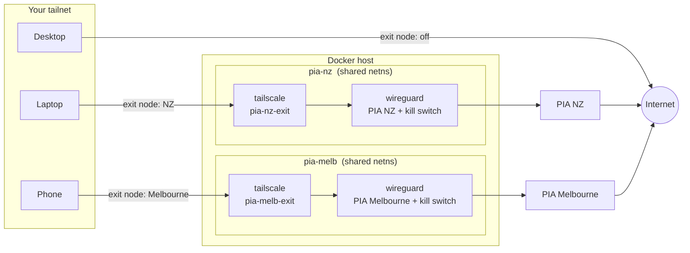
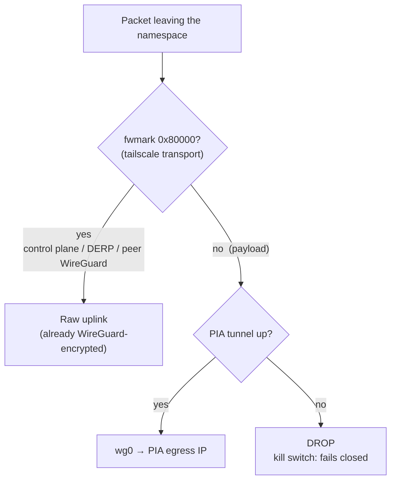

# tailscale-pia-exit

[](LICENSE)
[](https://github.com/latticelabs-au/tailscale-pia-exit/pkgs/container/tailscale-pia-exit)
[](https://tailscale.com/kb/1103/exit-nodes)
[](https://www.privateinternetaccess.com/)

A Tailscale [exit node](https://tailscale.com/kb/1103/exit-nodes) whose internet
egress is routed through a [Private Internet Access](https://www.privateinternetaccess.com/)
WireGuard tunnel.

Pick the node from the exit-node menu on any device in your tailnet and all of
that device's traffic leaves via PIA in the region you chose. You get Tailscale
**and** a commercial VPN at the same time, per device, switchable in two clicks,
without installing a VPN client anywhere.



## Why

Running a VPN client and Tailscale on the same machine usually means they fight
over the default route: one wins, the other breaks. This side-steps the fight
entirely. The exit node lives in a network namespace where the only route out
for payload traffic is the PIA tunnel, and Tailscale offers that namespace to
the rest of your tailnet. Devices opt in per-connection from the exit-node
menu and opt out just as fast.

- **PIA WireGuard done natively**: your username/password, no hand-managed
  configs, keys registered fresh on every start.
- **Fails closed**: if the tunnel drops, the kill switch drops everything with
  it. The exit node goes dark rather than leaking your real IP.
- **Kernel-mode forwarding**: ~510 Mbps measured through the exit against a
  ~620 Mbps tunnel ceiling (userspace fallback available).
- **One region per env file**: run as many exit locations as you like off one
  compose file.

## How traffic is routed

Payload and Tailscale's own transport are split deliberately, the same way
Tailscale's built-in Mullvad integration does it:



What peers browse through the exit node can only ever leave via PIA. What the
node itself says to the Tailscale control plane and to your other devices
(already end-to-end encrypted) uses the raw uplink, which is what lets peers
negotiate fast direct connections instead of bouncing through DERP relays.
Full detail, including the three firewall/backend gotchas this repo solves for
you, in [`docs/how-it-works.md`](docs/how-it-works.md).

## Performance

Measured on the reference deploy (TrueNAS SCALE, client on the same LAN,
AU-local test file via PIA Melbourne):

| Path | Throughput |
|---|---|
| PIA tunnel ceiling (inside the node) | ~620 Mbps |
| Client → exit node, **kernel mode (default)** | **~510 Mbps** |
| Client → exit node, userspace mode | ~285 Mbps |

## Requirements

- Docker with the Compose plugin, `/dev/net/tun` on the host (standard Linux).
- A PIA subscription (`p1234567`-style username + password).
- A Tailscale account.

## Quick start (compose, two containers)

```bash
git clone https://github.com/latticelabs-au/tailscale-pia-exit.git
cd tailscale-pia-exit

mkdir -p envs
cp .env.example envs/nz.env
# edit envs/nz.env: PIA_USER, PIA_PASS, PIA_LOC, TS_HOSTNAME

docker compose -p pia-nz --env-file envs/nz.env up -d
```

If you left `TS_AUTHKEY` empty, grab the one-time login URL:

```bash
docker compose -p pia-nz logs tailscale | grep -m1 'https://login.tailscale.com'
```

Then in the [admin console](https://login.tailscale.com/admin/machines), on the
new machine: **Approve exit node** (until approved, clients show "no exit node
available") and, recommended, **Disable key expiry**.

Confirm from any device with the exit node selected:

```bash
curl https://ipinfo.io   # PIA IP in your chosen region
```

## Quick start (single container)

A fused image, PIA WireGuard + Tailscale in one container, is published to
GHCR for the simplest possible deployment:

```bash
docker run -d --name pia-exit \
  --cap-add NET_ADMIN \
  --device /dev/net/tun \
  --sysctl net.ipv4.ip_forward=1 \
  -e LOC=nz -e USER=p1234567 -e PASS=your_pia_password \
  -e LOCAL_NETWORK=192.168.1.0/24 \
  -e TS_HOSTNAME=pia-nz-exit \
  -v pia:/pia -v tailscale:/var/lib/tailscale \
  --restart unless-stopped \
  ghcr.io/latticelabs-au/tailscale-pia-exit:latest
```

Compose version in
[`examples/single-container/`](examples/single-container/). All the base
image's PIA options ([thrnz/docker-wireguard-pia](https://github.com/thrnz/docker-wireguard-pia#config))
and the `TS_*` variables above apply.

## Multiple regions

Same compose file, one project + env file per region; volumes are namespaced by
project so state never collides:

```bash
docker compose -p pia-nz   --env-file envs/nz.env        up -d
docker compose -p pia-melb --env-file envs/melbourne.env up -d
```

Worked two-region example in
[`examples/multi-region/`](examples/multi-region/).

## Operating notes

- **Verify egress without Tailscale**: `./scripts/check-egress.sh pia-nz`
  prints the tunnel's public IP + geo from inside the node.
- **Change region**: edit `PIA_LOC`, `up -d` again.
- **Update**: `docker compose -p pia-nz pull && docker compose -p pia-nz up -d`.
- **Fallback for restricted hosts**: set `TS_USERSPACE=true` (compose mode) if
  you cannot grant `NET_ADMIN`/`NET_RAW` or a TUN device to the tailscale
  container. Slower, and remote peers will usually be DERP-relayed.
- **Fail-closed check**: `docker stop <project>-wireguard-1` and watch the exit
  node go dark instead of leaking.

## Credits

Stands on [`thrnz/docker-wireguard-pia`](https://github.com/thrnz/docker-wireguard-pia)
(PIA's WireGuard registration dance + kill switch) and the official
[`tailscale/tailscale`](https://tailscale.com/kb/1282/docker) image. This repo
is the glue, the firewall/backend fixes, and the documentation.

## License

MIT. See [`LICENSE`](LICENSE).
